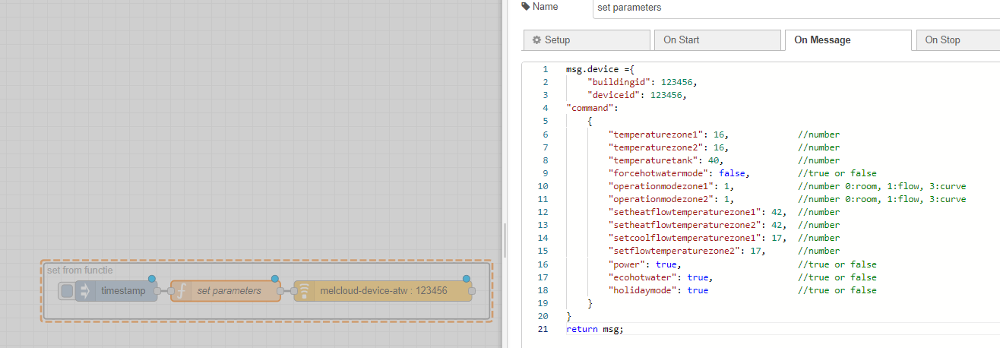

# node-red-contrib-melcloud-atw

Only for Air-to-Water heatpumps.

For Air-to-Air heatpumps use : node-red-contrib-melcloud. 

The nodes are triggerd from any incoming payload.

## melcloud-connect-atw node

First in creditentials 'add a new melcloud-creditentials-atw' and enter your credentials from your Mitsubishi Melcloud account (email and password)

Then select for '>-Command' 'Devices list'

With a debug node find your buildingId and deviceId (under Structures > Devices)

When calling this node most of the heatpump's parameters are published (under Structures > Devices > Devices).

Only call the node with a maximum frequency of 15 minutes, otherwise some of the data will not get updated. 

## melcloud-device-atw

Select your credential settings and provide the buildingId and deviceId.
Only 3 parameters can be written to your device from the node
 * SetTemperatureZone1
 * SetTemperatureZone2
 * SetTankTemperature

For SHW 'force hot water' can be set to On for instant startup. 

Parameters can be left blank, exept for the ID's, if not needed. 
The node returns a list of actual parameters from the heatpump. 

## from a function 

Parameters can be provided from a function and send with a payload to the melcloud-device-atw node.
Just privide the ID's and the parameter that needs to be published.
If a parameter does not need to be publised, just leave it out. 
Available parameters from a function send as

msg.device ={
    "buildingid": xxxx,
    "deviceid": xxxx,
"command":
    {
        "temperaturezone1" : integer,
	"temperaturezone2" : integer,
	"temperaturetank" : integer,
	"forcehotwatermode" : boolean,
	"heatflowzone1" : integer,
	"heatflowzone2" : integer

    }
}
return msg;

based on node-red-contrib-melcloud by ysimonx